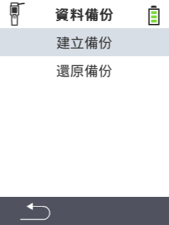

<map name="workmap">
  <area shape="rect" coords="2,40,238,80" alt="建立備份" title="建立備份的說明可以在這裡找到&#10;滑鼠點擊：開啟文件" href="/zh/docs/backup/backup/">

  <area shape="rect" coords="2,80,238,120" alt="還原備份" title="還原備份的說明可以在這裡找到&#10;滑鼠點擊：開啟文件" href="/zh/docs/backup/restore/">

  <area shape="rect" coords="2,282,120,319" alt="返回" title="返回上一層&#10;滑鼠點擊：開啟文件" href="/zh/docs/device/data-management/">
</map>
