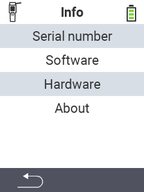

{}
如果您點擊選單項目，將會被重定向到相應功能的描述。
{}

<map name="workmap">
  <area shape="rect" coords="2,40,238,80" alt="序號" title="點擊此處以檢索您的裝置序號&#10;滑鼠點擊：查看文件" href="/en/docs/device/info/serial-number/">
  <area shape="rect" coords="2,80,238,120" alt="軟體" title="在此可找到查看您的軟體版本的說明&#10;滑鼠點擊：查看文件" href="/en/docs/firmware/versions/">
  <area shape="rect" coords="2,120,238,160" alt="硬體" title="點擊此處以訪問您的裝置硬體資訊&#10;滑鼠點擊：查看文件" href="/en/docs/device/info/hardware/">
  <area shape="rect" coords="2,160,238,200" alt="關於" title="調出供應商資訊&#10;滑鼠點擊：查看文件" href="/en/docs/device/info/about/">

  <area shape="rect" coords="2,282,120,319" alt="返回" title="跳回上一層&#10;滑鼠點擊：打開文件" href="/en/docs/device/">
</map>
