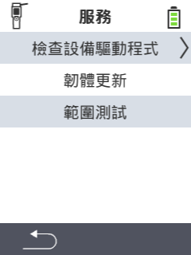

{}
如果您點擊菜單項目，將會被重定向到相應功能的描述。
{}

<map name="workmap">
  <area shape="rect" coords="2,42,238,82" alt="檢查設備驅動程式" title="檢查您的設備驅動程式的說明可以在這裡找到&#10;滑鼠點擊：打開文件" href="/en/docs/diagnosis/hardware/">
  <area shape="rect" coords="2,82,238,122" alt="韌體更新" title="更新您的韌體的說明可以在這裡找到&#10;滑鼠點擊：打開文件" href="/en/docs/firmware/update/">
  <area shape="rect" coords="2,122,238,162" alt="範圍測試" title="執行範圍測試的說明可以在這裡找到&#10;滑鼠點擊：打開文件" href="/en/docs/diagnosis/rfid-scan/">

  <area shape="rect" coords="2,282,120,319" alt="返回" title="返回上一層&#10;滑鼠點擊：打開文件" href="/en/docs/device/">
</map>
