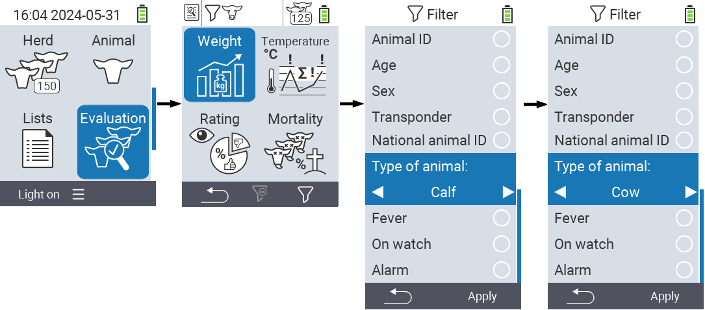
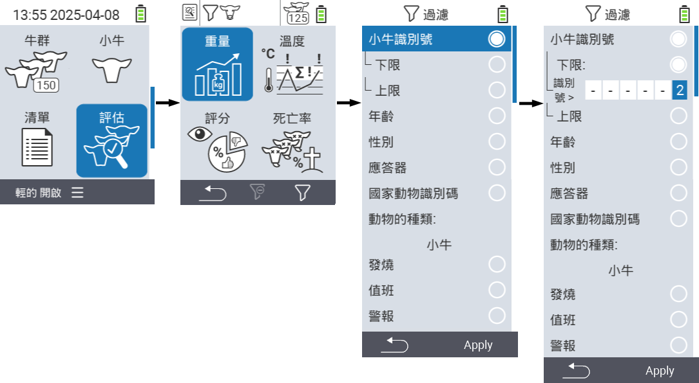
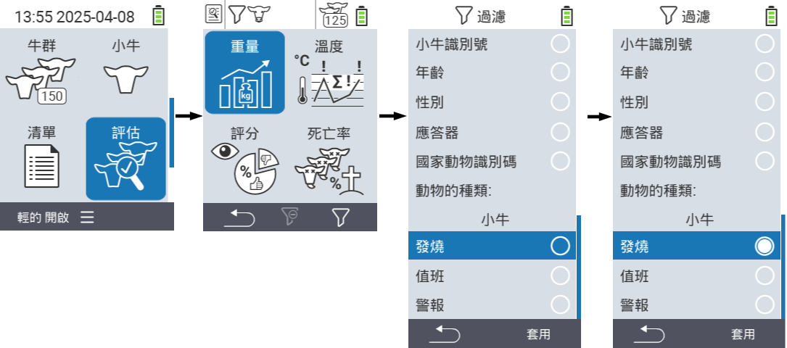

## 應用篩選器 {#applying-filters}

{}
篩選器幫助您在 VitalControl 設備的選單項目 ``、`` 和 `` 中使用篩選條件進行選擇。當您應用篩選器時，各種篩選條件的符號會出現在螢幕頂部。這些符號用於幫助您了解是否以及哪些篩選條件被啟用。例如，如果您將 `` 篩選器設置為男性，設備將僅使用男性動物。例如，如果您還啟用了 `` 篩選器，設備將僅使用在觀察列表上的男性動物。
{}

要在評估中創建篩選器，請按以下步驟進行：

1. 在頂部選單項目  `` 所屬的子選單中，按一次 `F3` 鍵 。在頂部選單項目  `` 和  `` 所屬的子選單中，您需要按兩次鍵。

2. 會打開一個子選單，您可以在其中設置所有篩選選項。您可以按 ``、``、``、``、``、``、``、`` 和 `` 進行篩選。

3. 對於 ``、``、`` 和 `` 篩選器，導航到相應區域並確認 ``。使用箭頭鍵 ◁ ▷ 指定所需設置。使用 `F3` 鍵 `` 來放置所選設置。要放棄篩選更改，請按 `F1` 鍵 &nbsp;&nbsp;。

   

4. 對於篩選條件 `` 和 ``，選擇相應的標準並確認 ``。現在會顯示上下限。使用箭頭鍵 △ ▽ 導航至所需的限制，並按兩次 `` 確認。現在可以使用箭頭鍵 ◁ ▷ 和箭頭鍵 △ ▽ 設定所需的數字。所有設定正確後，再次按 `` 離開設定模式，並使用 `F3` 鍵 `` 套用選擇的篩選條件。使用 `F1` 鍵 &nbsp;&nbsp;，可以放棄更改。

   

5. 對於篩選條件 ``、`` 和 ``，可以選擇禁用或啟用其應用。為此，選擇相應的篩選條件並確認 ``。篩選條件現在已啟用。再次確認 `` 以停用篩選條件。

   

6. 設定所有篩選條件後，使用 `F3` 鍵 `` 套用已定義的篩選條件，或按 `F1` 鍵  放棄對篩選條件的更改。
