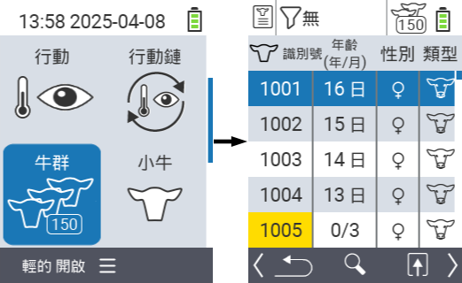
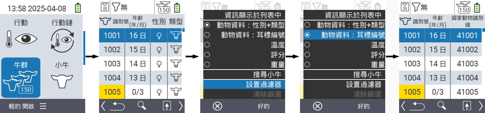
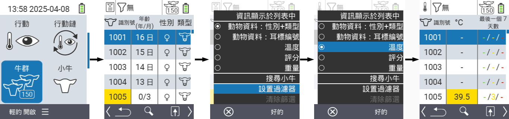
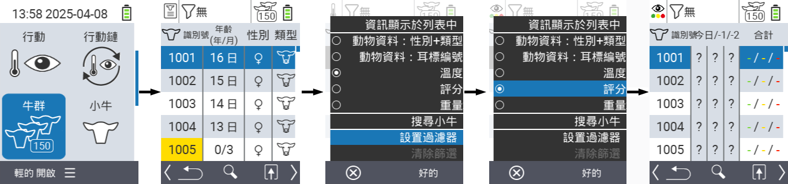
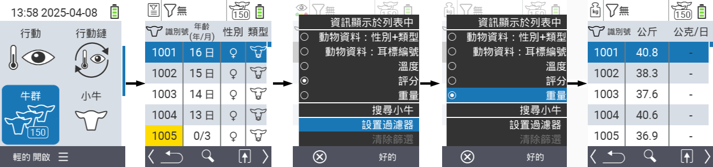
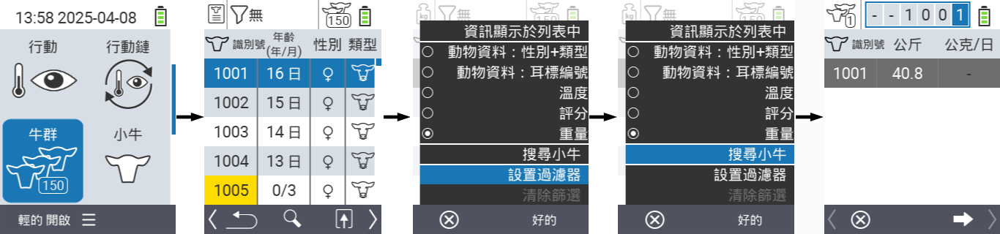
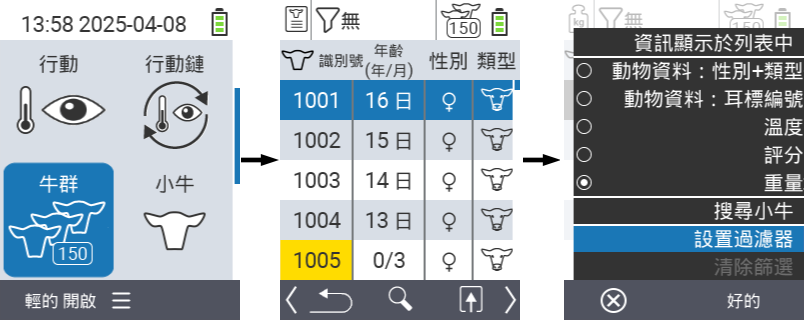
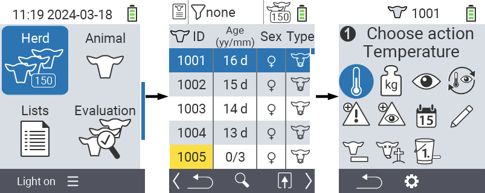

## 畜群 {#herd}

在畜群選單項目中，您可以查看整個畜群，搜尋個別動物並顯示重要資訊。您有以下選擇：

- 查看[動物資料](#view-animal-data)
- 查看[溫度資料](#display-temperature)
- 查看[評分資料](#view-rating)
- 查看[重量資料](#view-rating)
- [搜尋動物](#search-animal)
- 設定[篩選器](#set-filter)
- [操作](#call-action-menu)

### 準備步驟 {#preparatory-steps}

1. 在您的 VitalControl 設備主畫面上，選擇選單項目  `` 並按下 `` 按鈕。

2. 您的畜群概覽將會打開。

    

### 查看動物資料 {#view-animal-data}

1. 完成準備步驟。

2. 使用 `F3` 鍵 &nbsp;&nbsp; 呼叫一個彈出選單，列出可以顯示於畜群列表的資訊類別。使用箭頭鍵 △ ▽ 突出顯示 `` 或 `` 行，並按下中央 `` 按鈕或 `F3` 鍵 `` 來選擇此類別。兩個選擇選項在資訊欄的顯示上有所不同。

3. 動物資料現在將作為畜群列表的內容顯示。

4. 或者，您可以使用箭頭鍵 ◁ ▷ 在不同的顯示選項之間切換。

    

{}
預設情況下，動物資料會首先顯示。只有當您顯示重量時，才需要再次設定動物資料的顯示。
{}

### 顯示溫度 {#display-temperature}

1. 完成準備步驟。

2. 使用 `F3` 鍵 &nbsp;&nbsp; 呼叫彈出選單，該選單列出可以顯示在畜群列表中的信息類別。使用箭頭鍵 △ ▽ 突出顯示行 ``，然後按下中央 `` 按鈕或 `F3` 鍵 `` 選擇此類別。

3. 現在溫度數據將顯示為畜群列表的內容。

4. 或者，您可以使用箭頭鍵 ◁ ▷ 在不同的顯示選項之間切換。

    

### 查看評分 {#view-rating}

1. 完成準備步驟。

2. 使用 `F3` 鍵 &nbsp;&nbsp; 呼叫彈出選單，該選單列出可以顯示在畜群列表中的信息類別。使用箭頭鍵 △ ▽ 突出顯示行 ``，然後按下中央 `` 按鈕或 `F3` 鍵 `` 選擇此類別。

3. 現在評分數據將顯示為畜群列表的內容。

4. 或者，您可以使用箭頭鍵 ◁ ▷ 在不同的顯示選項之間切換。

    

### 顯示重量 {#display-weight}

1. 完成準備步驟。

2. 使用 `F3` 鍵 &nbsp;&nbsp; 呼叫彈出選單，該選單列出可以顯示在畜群列表中的信息類別。使用箭頭鍵 △ ▽ 突出顯示行 ``，然後按下中央 `` 按鈕或 `F3` 鍵 `` 選擇此類別。

3. 現在重量數據將顯示為畜群列表的內容。

4. 或者，您可以使用箭頭鍵 ◁ ▷ 在不同的顯示選項之間切換。

    

### 搜尋動物 {#search-animal}

1. 完成準備步驟。

2. 使用 `F3` 鍵 &nbsp;&nbsp; 呼叫彈出選單，列出各種選項。使用箭頭鍵 △ ▽ 突出顯示功能 ``，並按下中央 `` 鍵或 `F3` 鍵 `` 來啟動搜尋功能。或者，你可以在第一步後立即使用 `On/Off` 按鈕 。

3. 使用箭頭鍵 △ ▽ ◁ ▷ 輸入所需的動物編號，並按 `` 確認。

    

### 設定篩選器 {#set-filter}

1. 完成準備步驟。

2. 使用 `F3` 鍵 &nbsp;&nbsp; 呼叫彈出選單，列出各種選項。使用箭頭鍵 △ ▽ 突出顯示功能 ``，並按下中央 `` 鍵或 `F3` 鍵 `` 來啟動篩選功能。

3. 如何應用篩選器可以在[這裡]()找到。

    

### 呼叫動作選單 {#call-action-menu}

你總是可以選擇為動物呼叫動作選單。

1. 完成準備步驟。

2. 使用箭頭鍵 △ ▽ 從列表中選擇一個動物，並按 `` 確認。

3. 動作選單現在已打開。如何使用可以在[這裡](../actions)找到。

4. 使用 `F3` 鍵返回群組列表。

    
