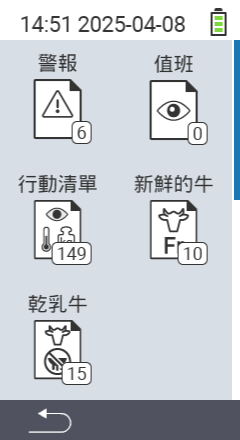

{}
如果您點擊菜單項目，將會被重定向到相應功能的描述。
{}

<map name="workmap">
  <area shape="rect" coords="3,40,116,160" alt="警報清單" title="查看您的警報清單&#10;滑鼠點擊：打開文件" href="/en/docs/lists/alarm/">
  <area shape="rect" coords="3,160,116,280" alt="行動清單" title="查看您的行動清單&#10;滑鼠點擊：打開文件" href="/en/docs/lists/actions/">
  <area shape="rect" coords="3,280,116,399" alt="乾奶牛清單" title="查看您的乾奶牛清單&#10;滑鼠點擊：打開文件" href="/en/docs/lists/dry-cows/">

  <area shape="rect" coords="116,40,230,160" alt="觀察清單" title="查看您的觀察清單&#10;滑鼠點擊：打開文件" href="/en/docs/lists/on-watch/">
  <area shape="rect" coords="116,160,230,280" alt="新鮮奶牛" title="查看您的新鮮奶牛清單&#10;滑鼠點擊：打開文件" href="/en/docs/lists/fresh-cows/">

  <area shape="rect" coords="2,401,115,438" alt="返回" title="返回上一層" href="/en/docs/menu/mainmenu/">
</map>
