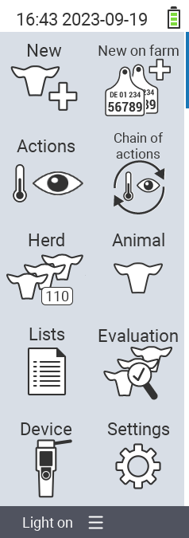

{}
如果您點擊選單項目，將會被重定向到相應功能的描述。
{}

<map name="workmap">
  <area shape="rect" coords="3,40,116,160" alt="新增" title="新增動物&#10;滑鼠點擊：開啟文件" href="/en/docs/new/">
  <area shape="rect" coords="3,160,116,280" alt="動作" title="動物動作&#10;滑鼠點擊：開啟文件" href="/en/docs/actions/">
  <area shape="rect" coords="3,280,116,400" alt="群體" title="群體選單&#10;滑鼠點擊：開啟文件" href="/en/docs/herd/">
  <area shape="rect" coords="3,400,116,520" alt="清單" title="動物清單&#10;滑鼠點擊：開啟文件" href="/en/docs/lists/">
  <area shape="rect" coords="3,520,116,634" alt="裝置" title="裝置&#10;滑鼠點擊：開啟文件" href="/en/docs/device/">

  <area shape="rect" coords="116,40,230,160" alt="農場新增" title="動物存取&#10;滑鼠點擊：開啟文件" href="/en/docs/new-on-farm/">
  <area shape="rect" coords="116,160,230,280" alt="動作鏈" title="動作鏈&#10;滑鼠點擊：開啟文件" href="/en/docs/chain-of-actions/">
  <area shape="rect" coords="116,280,230,400" alt="動物" title="動物&#10;滑鼠點擊：開啟文件" href="/en/docs/animal/">
  <area shape="rect" coords="116,400,230,520" alt="評估" title="評估&#10;滑鼠點擊：開啟文件" href="/en/docs/evaluation/">
  <area shape="rect" coords="116,520,230,634" alt="設定" title="設定&#10;滑鼠點擊：開啟文件" href="/en/docs/settings/">
</map>
