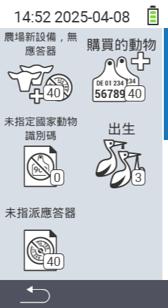

{}
如果您點擊菜單項目，將會被重定向到相應功能的描述。
{}

<map name="workmap">
  <area shape="rect" coords="3,40,116,160" alt="農場新動物，無晶片" title="在這裡您可以為沒有晶片的新動物分配晶片&#10;滑鼠點擊：打開文件" href="/en/docs/new-on-farm/new-no-transponder/">
  <area shape="rect" coords="3,160,116,280" alt="未分配國家動物ID" title="在這裡您可以查看所有尚未分配國家動物ID的動物，並分配國家動物ID&#10;滑鼠點擊：打開文件" href="/en/docs/new-on-farm/no-national-animal-id-assigned/">
  <area shape="rect" coords="3,280,116,399" alt="未分配晶片" title="在這裡您可以查看所有尚未分配晶片的動物，並為它們分配晶片&#10;滑鼠點擊：打開文件" href="/en/docs/new-on-farm/no-transponder-assigned/">

  <area shape="rect" coords="116,40,230,160" alt="購買的動物" title="在這裡您可以查看當前的購買情況並導出數據&#10;滑鼠點擊：打開文件" href="/en/docs/new-on-farm/purchased-animals/">
  <area shape="rect" coords="116,160,230,280" alt="出生" title="在這裡您可以查看出生情況並創建導出文件&#10;滑鼠點擊：打開文件" href="/en/docs/new-on-farm/births/">
  <area shape="rect" coords="1,401,100,439" alt="返回" title="返回上一級&#10;滑鼠點擊：到文件" href="/en/docs/menu/mainmenu/">
</map>
