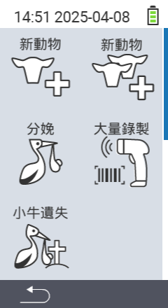

透過主選單項目  ``，您可以進入子選單，其中提供5個子項目供選擇：

<map name="workmap">
  <area shape="rect" coords="3,40,116,160" alt="New animal" title="如何使用 VitalControl 設備登記新動物&#10;滑鼠點擊：打開文件" href="/en/docs/new/animal/">
  <area shape="rect" coords="3,160,116,280" alt="Calving" title="如何使用 VitalControl 設備登記新分娩&#10;滑鼠點擊：打開文件" href="/en/docs/new/calving/">
  <area shape="rect" coords="3,280,116,399" alt="Animal loss" title="如何使用 VitalControl 設備登記動物損失&#10;滑鼠點擊：打開文件" href="/en/docs/new/animal-loss/">

  <area shape="rect" coords="116,40,230,160" alt="New animals" title="如何在 VitalControl 設備上一次性創建多個新動物&#10;滑鼠點擊：打開文件" href="/en/docs/new/animals/">
  <area shape="rect" coords="116,160,230,280" alt="Bulk recording" title="使用條碼掃描器記錄多種動物&#10;滑鼠點擊：打開文件" href="/en/docs/new/bulk-recording/">

  <area shape="rect" coords="1,401,100,439" alt="Back" title="返回上一級&#10;滑鼠點擊：到文件" href="/en/docs/menu/mainmenu/">
</map>

{}
每個子選單都有其自己的圖標。將鼠標指針移到上圖中的圖標上，並讓它停留片刻。會出現一個工具提示，顯示所選子選單的資訊。如果您點擊其中一個圖標，您將被轉發到所選子選單項的描述。
{}

请粘贴您需要翻译的Markdown内容。
