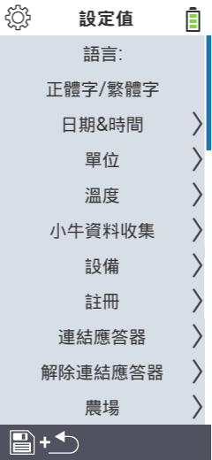

{}
如果您點擊一個選單項目，您將被重定向到相應功能的描述。
{}

<map name="workmap">
  <area shape="rect" coords="2,40,230,120" alt="語言" title="設定並永久儲存您的 VitalControl 裝置的使用者介面語言&#10;滑鼠點擊：開啟文件" href="/zh/docs/settings/language/">
  <area shape="rect" coords="2,120,230,160" alt="日期與時間" title="在此設定日期和時間&#10;滑鼠點擊：開啟文件" href="/zh/docs/settings/datetime/">
  <area shape="rect" coords="2,160,230,200" alt="單位" title="在此選擇溫度和質量的單位&#10;滑鼠點擊：開啟文件" href="/zh/docs/settings/units/">
  <area shape="rect" coords="2,200,230,240" alt="溫度" title="設定您的 VitalControl 裝置應用的溫度設定&#10;滑鼠點擊：開啟文件" href="/zh/docs/settings/temperature/">
   <area shape="rect" coords="2,240,230,280" alt="數據採集" title="在此儲存動物數據收集的相關資訊&#10;滑鼠點擊：開啟文件" href="/zh/docs/settings/data-acquisition/">
   <area shape="rect" coords="2,280,230,320" alt="設備" title="在此您可以調整各種設備設定&#10;滑鼠點擊：開啟文件" href="/zh/docs/settings/device/">
   <area shape="rect" coords="2,320,230,360" alt="動物註冊" title="在此您可以根據農場需求調整多個工廠設定的動物註冊標準。&#10;滑鼠點擊：開啟文件" href="/zh/docs/settings/animal-registration/">
   <area shape="rect" coords="2,360,230,400" alt="連結晶片" title="設定您的 VitalControl 裝置上的晶片分配&#10;滑鼠點擊：開啟文件" href="/zh/docs/settings/transponder-linkage/">
   <area shape="rect" coords="2,400,230,439" alt="解除晶片連結" title="指定晶片拆除後如何分配動物 ID&#10;滑鼠點擊：開啟文件" href="/zh/docs/settings/transponder-linkage/">
   <area shape="rect" coords="2,440,230,480" alt="農場" title="在 VitalControl 裝置上永久儲存您的官方十二位數國家農場 ID&#10;滑鼠點擊：開啟文件" href="/zh/docs/settings/farm-number/">
   <area shape="rect" coords="2,482,123,519" alt="返回" title="返回上一層" href="/zh/docs/menu/mainmenu/">
</map>
